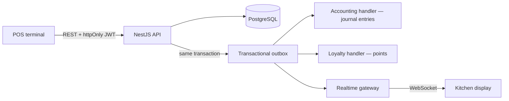

# BranchBrew ERP ☕

[](https://github.com/nkieu-config/branchbrew-cafe-erp-project/actions/workflows/ci.yml)
[](LICENSE)


Multi-branch coffee-shop ERP in a single TypeScript monorepo — point of sale, realtime kitchen display, batch inventory, procurement, central-kitchen production, HR & payroll, CRM loyalty, and event-driven double-entry accounting.


## Live demo

> 🔗 Hosted demo coming soon — meanwhile the full stack runs locally in two commands ([Quick start](#quick-start)).

| | |
|---|---|
| **Manager login** | `manager@branchbrew.dev` |
| **Password** | `password123` |

More demo accounts (super admin, barista, second branch) and a 15-minute guided tour: [docs/demo.md](docs/demo.md).

## Features

- **Point of sale** — product catalog with modifiers, member lookup, promo codes, cash payment with change, printable receipts, keyboard shortcuts
- **Kitchen display** — realtime order board over WebSockets with ticket aging and a live connection badge
- **Inventory** — batch tracking with first-expired-first-out deduction, expiry alerts, inter-branch transfers, waste disposal, DB-enforced non-negative stock, and blind stocktakes whose approved variances adjust stock and post shrinkage to the ledger
- **Procurement** — suppliers, purchase orders, goods receiving, low-stock auto-reorder, supplier payments that settle accounts payable in the ledger
- **Central kitchen** — bills of materials and production orders that consume raw batches and produce finished-goods batches
- **HR** — shift scheduling, attendance, leave approvals, payroll runs
- **Finance** — double-entry general ledger posted from domain events (sales split into revenue + output VAT, COGS, payroll, expenses, AP), P&L trend, AP aging, ภ.พ.30-style VAT report, shift settlements, CSV export
- **CRM** — customer membership with loyalty points earned and redeemed at the till
- **Organization** — multiple branches with role-based access (super admin / manager / staff) and an audit log
- **Notifications** — in-app alerts for low stock, expiring batches, maintenance due, pending approvals, and leave decisions, pushed live over WebSockets with role-scoped visibility and unread-dedupe

| POS terminal | Kitchen display |
|---|---|
|  |  |

| Batch inventory — FEFO & expiry calendar | General ledger |
|---|---|
|  |  |

<details>
<summary>📸 More screenshots — stocktake, central kitchen, procurement, CRM, HR, dark mode</summary>

| Stocktake variance review | Central kitchen production board |
|---|---|
|  |  |

| Purchase orders | CRM loyalty members |
|---|---|
|  |  |

| Shift scheduling | Dashboard in dark mode |
|---|---|
|  |  |

</details>

## Architecture

The POS never writes journal entries or pushes sockets directly. Business writes commit together with **outbox events** in one database transaction; handlers then post accounting entries, award loyalty points, and broadcast realtime updates — side effects cannot desync from committed state.



```
backend/          NestJS 11 API — ~20 feature modules, Prisma, transactional outbox
frontend/         Next.js 16 App Router — POS, KDS, back office
packages/types    Shared enums generated from the Prisma schema
infra/            Docker Compose stacks + deployment reference
docs/             Demo script, design system, screenshots
scripts/          CI and Docker helper scripts
```

Decisions worth reading the code for:

- **Money is never a float** — all financial math runs on `Prisma.Decimal` with explicit rounding scales; journal entries must balance to the cent
- **Typed API contract** — the backend exports `openapi.json`, the frontend generates its client types from it, and CI fails if either drifts
- **JWT with revocation** — httpOnly cookie auth plus a per-user token version, so logout actually invalidates stolen tokens
- **Branch-scoped authorization** — every module resolves data through a shared branch-scope helper; staff can't reach another branch's data
- **Standard costing** — production posts cost variance to a dedicated GL account instead of pretending costs are always exact

## Tech stack

| Layer | Stack |
|---|---|
| Frontend | Next.js 16 (App Router), React 19, TanStack Query 5, Ant Design 6, Tailwind CSS 4 |
| Backend | NestJS 11, Prisma 7, PostgreSQL, Passport JWT, socket.io |
| Testing | Jest, Vitest, Playwright (with axe accessibility checks), supertest |
| Infra & CI | Docker multi-stage builds, Docker Compose, GitHub Actions, Trivy image scanning |

## Quick start

**Docker (recommended)** — migrations and demo seed run automatically:

```bash
cp infra/.env.compose.example infra/.env.compose
npm run docker:up
```

Open http://localhost:3001/login and use the demo login above. Details and production modes: [infra/README.md](infra/README.md).

**Local Node** (Node 22, a running Postgres):

```bash
npm install
cp backend/.env.example backend/.env   # set DATABASE_URL, JWT_SECRET
npm run migrate
npm run db:seed                        # wipes the target database — demo data
npm run dev:backend                    # API on :3000
npm run dev:frontend                   # UI on :3001
```

## Testing & quality

| Suite | Coverage |
|---|---|
| Backend unit (Jest) | 191 tests — services, money math, order lifecycle, accounting |
| Backend e2e (supertest) | 15 tests against a real Postgres — auth, orders, production, branch scoping |
| Frontend unit (Vitest) | 170 tests — validators, filters, API client |
| Frontend e2e (Playwright) | 15 tests — login, POS checkout flow, KDS, axe accessibility smoke |

CI runs type-checks, lint, coverage thresholds, all four suites, a Docker Compose smoke test, Trivy image scans, and drift checks for every generated artifact (`openapi.json`, shared enums, API client types).

```bash
npm test                    # unit suites
npm run test:e2e:backend
npm run test:e2e:frontend
```

## Documentation

| Doc | What's inside |
|---|---|
| [docs/demo.md](docs/demo.md) | 15-minute guided demo, all demo accounts, interview talking points |
| [docs/design-system.md](docs/design-system.md) | Design tokens, form patterns, antd/shadcn conventions |
| [infra/README.md](infra/README.md) | Docker stacks, env matrix, production modes, TLS on a VPS |
| [backend/README.md](backend/README.md) | API setup, architecture highlights, test commands |
| [frontend/README.md](frontend/README.md) | UI setup, generated API types, test commands |

## Known limitations & roadmap

Deliberate scope choices for a demo deployment:

- **No account lockout** — demo credentials are public, and lockout would let strangers lock reviewers out; login is IP-throttled instead
- **Standard costing** — ingredient costs are fixed per unit; purchase receipts don't compute weighted averages (variances post to a dedicated account)
- **Whole-order refunds only**, no promotion usage limits, and transfers don't reserve stock at request time (acceptance re-validates atomically)
- **Output VAT only** — sales post VAT to a dedicated liability account, but input VAT on purchases is out of scope

Planned next:

- Pagination across all list endpoints (audit and auth endpoints paginate today)
- End-to-end `Decimal` stock quantities (DB `CHECK` constraints already guard against negatives)
- Outbox hardening: exponential backoff, dead-letter queue with replay
- Scheduled reconciliation between branch stock and batch-level quantities

## License

[MIT](LICENSE)
