# BranchBrew ERP ☕

[](https://github.com/nkieu-config/branchbrew-cafe-erp-project/actions/workflows/ci.yml)
[](https://github.com/nkieu-config/branchbrew-cafe-erp-project/commits/main)
[](LICENSE)


**A full ERP for a multi-branch coffee-shop chain, built solo as my software-engineering capstone.** Point of sale, realtime kitchen display, batch inventory, procurement, central-kitchen production, HR & payroll, CRM loyalty — all wired into an event-driven double-entry ledger that always reconciles.

**26 backend modules · 130 REST endpoints · 41-table schema · 42 app pages · 405 automated tests · ~77k lines of strict TypeScript**

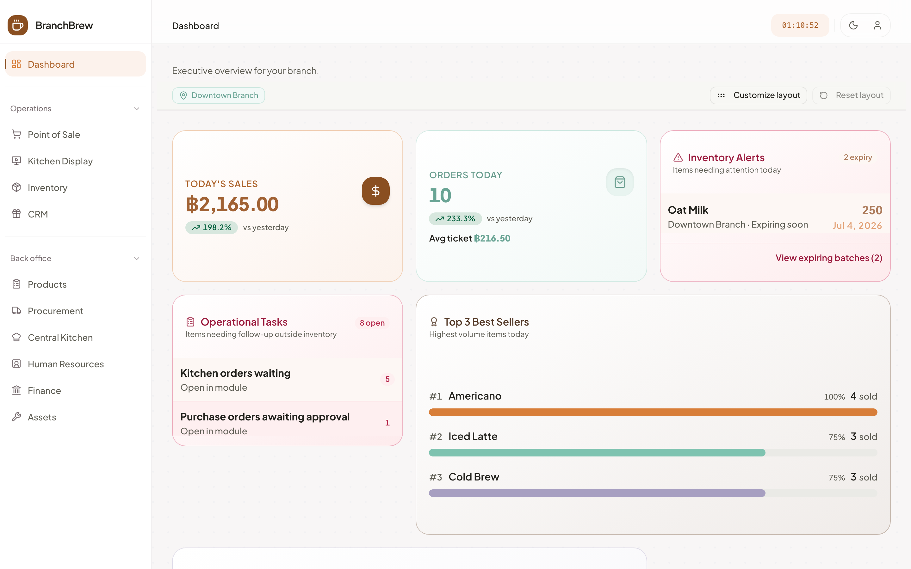

## Try it in 60 seconds

**🔗 Live demo: [branchbrew-cafe-erp.vercel.app](https://branchbrew-cafe-erp.vercel.app)** — click a demo account on the login page, no signup.

|                   |                          |
| ----------------- | ------------------------ |
| **Manager login** | `manager@branchbrew.dev` |
| **Password**      | `password123`            |

Then sell an Iced Latte at **POS → Terminal**, watch it appear on the **Kitchen Display**, and find its balanced journal entry under **Finance → Ledger**. More demo accounts and a 15-minute guided tour: [docs/demo.md](docs/demo.md).

> Hosted on free tiers (frontend on Vercel, API on Render), so the first request after the API idles can take ~30s to wake. Demo data resets on a schedule, so anything you change is temporary.

<details>
<summary>Or run the whole stack locally in two commands</summary>

```bash
cp infra/.env.compose.example infra/.env.compose
npm run docker:up
```

Open http://localhost:3001/login and use the same demo login above — migrations and demo seed run automatically.

</details>

## Why I built this

A coffee shop looks simple and is anything but. Milk expires, so stock has to be tracked in batches and used first-expired-first-out. Branches share a central kitchen that turns raw beans into cold-brew base. The Thai tax office wants a ภ.พ.30 VAT report. And when a barista taps **Pay**, five things must happen at once — deduct stock, award loyalty points, fire a kitchen ticket, record the sale, post the accounting — and they must **never disagree with each other**.

Most capstone projects stop at CRUD. I wanted to find out what it actually takes to keep money, stock, and realtime state consistent in one system, so I built the whole thing: from the cash-tendering keypad on the POS to the debit and credit lines it produces in the general ledger.

The rule I held myself to: **if two numbers in the system can drift apart, the design is wrong.** That one rule drove most of the architecture below.

## What happens when you sell one latte

1. The POS posts the order over REST (httpOnly-cookie JWT). The recipe deducts ingredient batches **first-expired-first-out**, with a database `CHECK` making negative stock impossible.
2. **In the same database transaction**, outbox events are written alongside the order — the order and its pending side effects commit or roll back together.
3. Outbox handlers then take over: one posts a balanced journal entry (ex-VAT revenue + output VAT liability + COGS), one awards loyalty points, one pushes the ticket to the kitchen display over WebSocket.
4. Because the ledger is written by the same events that move stock, **Finance → Ledger always reconciles with operations** — the AP balance matches the unpaid-PO aging list, and the accounting P&L agrees with the dashboard.

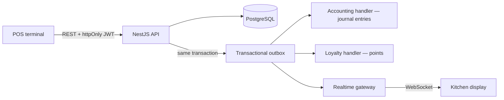

Full deep-dive — module map, accounting event table, inventory model, auth design: [docs/architecture.md](docs/architecture.md).

## Feature tour

| Module              | What it does                                                                                                                                  |
| ------------------- | --------------------------------------------------------------------------------------------------------------------------------------------- |
| **Point of sale**   | Product catalog with modifiers, member lookup, promo codes, cash tendering with change calculation, printable receipts, keyboard shortcuts    |
| **Kitchen display** | Realtime order board over WebSockets — ticket aging, all-day per-item totals, live connection badge                                           |
| **Dashboard**       | Draggable widget layout, 7/30-day revenue trend, gross margin & food-cost %, top-5 sellers, day-over-day average ticket                       |
| **Inventory**       | Batch tracking with FEFO deduction, expiry alerts, inter-branch transfers, waste disposal, blind stocktakes that post shrinkage to the ledger |
| **Procurement**     | Suppliers, purchase orders, goods receiving, low-stock auto-reorder, supplier payments that settle accounts payable                           |
| **Central kitchen** | Bills of materials and production orders that consume raw batches and produce finished-goods batches                                          |
| **HR & payroll**    | Shift scheduling, attendance, leave approvals, payroll runs that post to the ledger                                                           |
| **Finance**         | Double-entry GL posted from domain events, P&L trend, AP aging, ภ.พ.30-style VAT report, shift settlements, CSV export                        |
| **CRM & org**       | Loyalty membership earned/redeemed at the till, multi-branch RBAC (super admin / manager / staff), audit log, live in-app notifications       |

| POS terminal                                  | Kitchen display                         |
| --------------------------------------------- | --------------------------------------- |
| 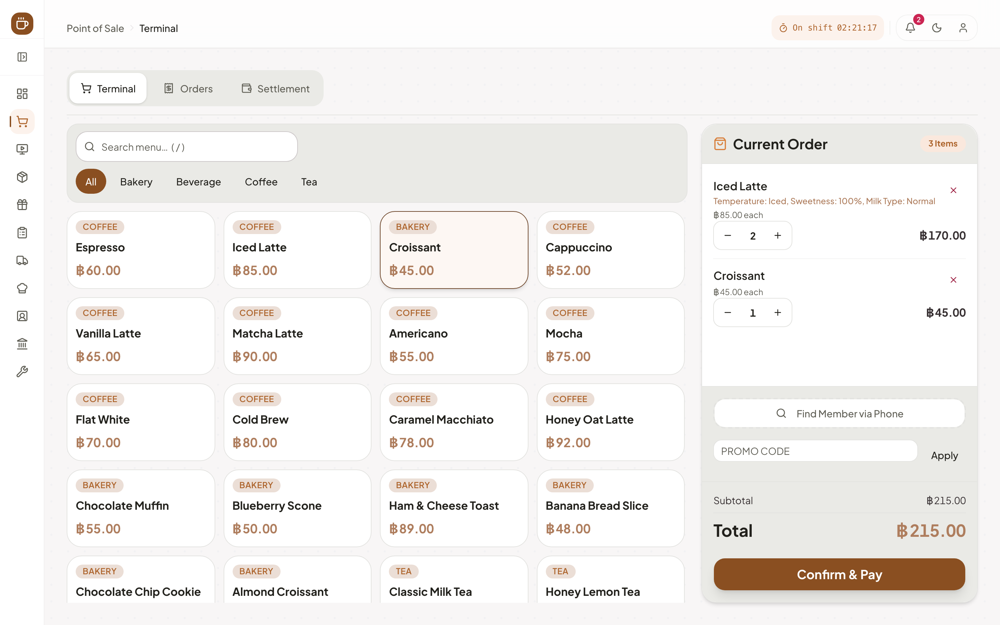 | 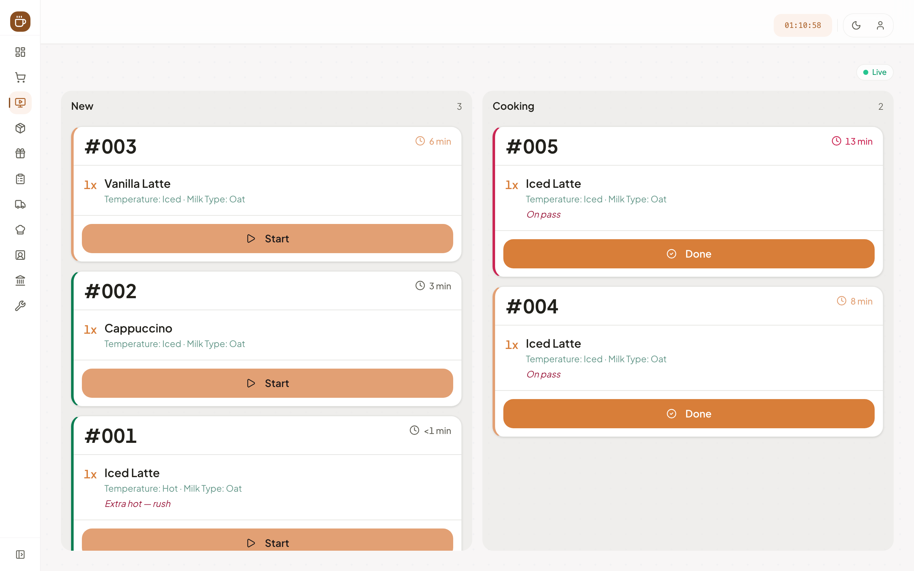 |

| Batch inventory — FEFO & expiry calendar                                     | General ledger                                    |
| ---------------------------------------------------------------------------- | ------------------------------------------------- |
| 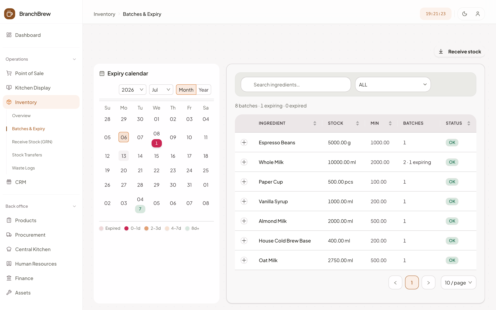 | 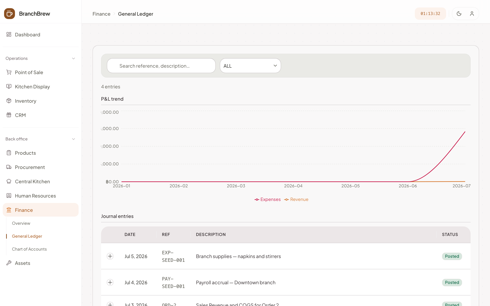 |

<details>
<summary>📸 More screenshots — stocktake, central kitchen, procurement, CRM, HR, dark mode</summary>

| Stocktake variance review                                 | Central kitchen production board                                      |
| --------------------------------------------------------- | --------------------------------------------------------------------- |
| 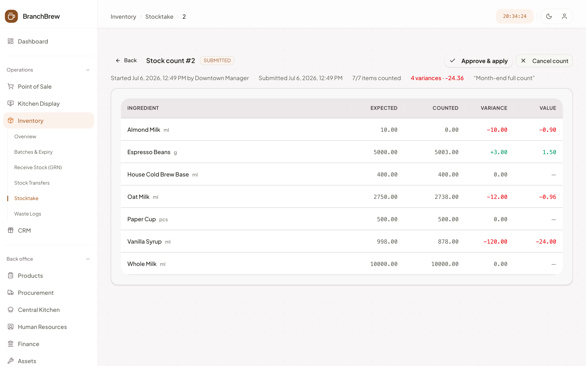 | 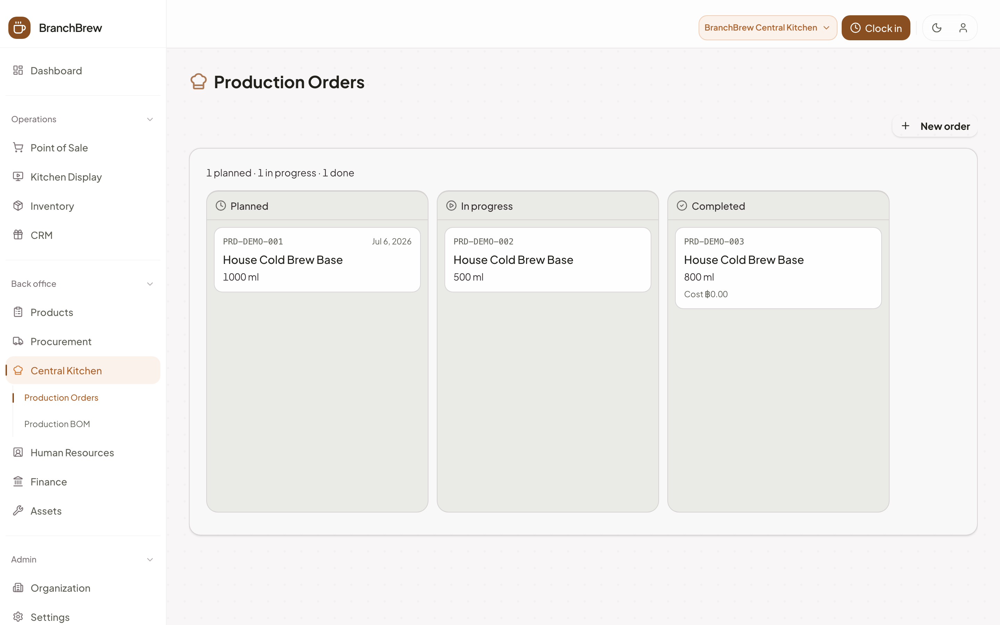 |

| Purchase orders                                                | CRM loyalty members                                               |
| -------------------------------------------------------------- | ----------------------------------------------------------------- |
| 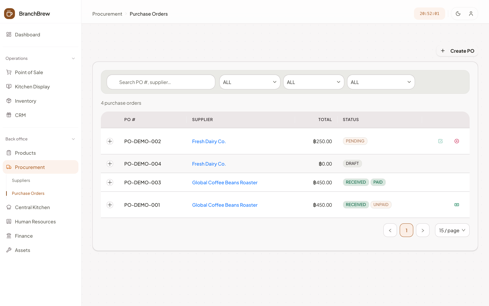 | 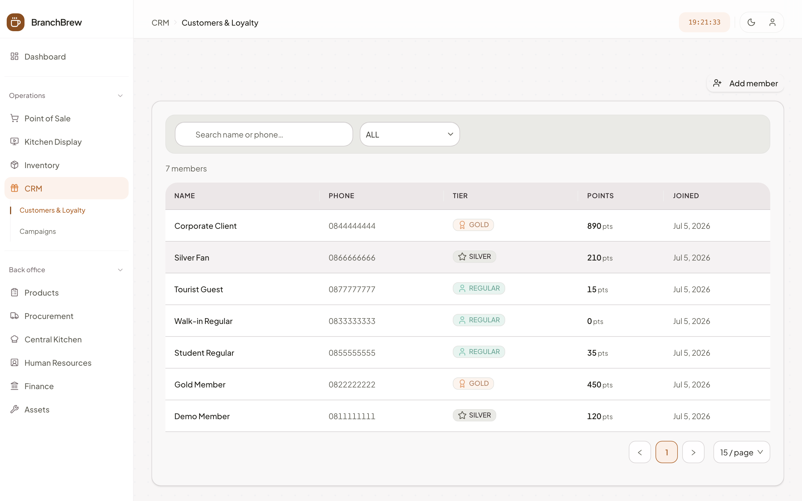 |

| Shift scheduling                                         | Dashboard in dark mode                                    |
| -------------------------------------------------------- | --------------------------------------------------------- |
| 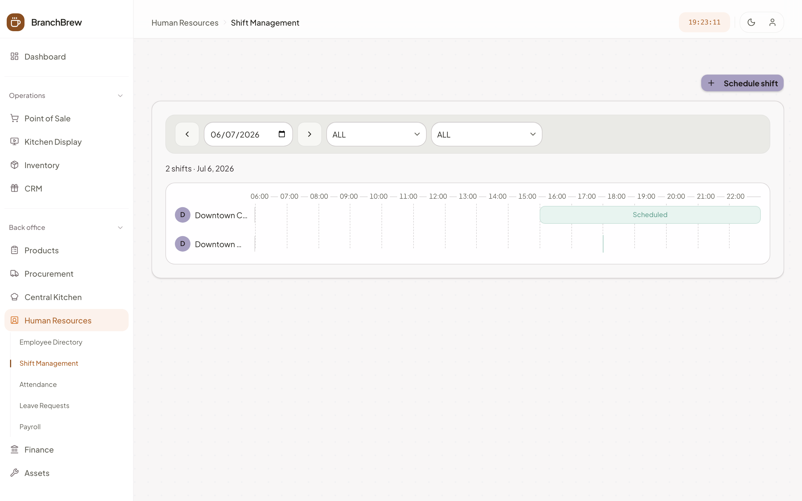 | 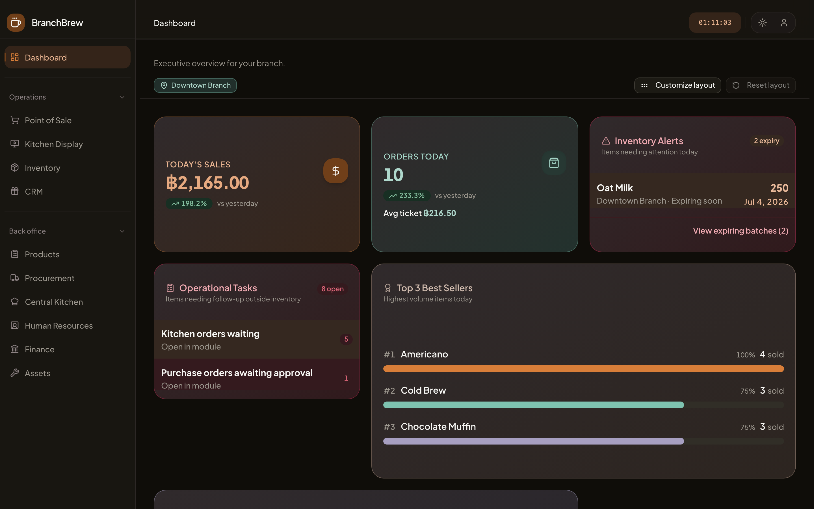 |

</details>

## Responsive by design

Every screen is built mobile-first — the app **reshapes** for a phone rather than shrinking. The sidebar becomes a bottom tab bar, the POS cart slides up as a bottom sheet, the KDS two-column board collapses into a swipeable New / Cooking switch, and data-dense tables fold each row into a card. It's driven by Tailwind breakpoints, a shared `useMediaQuery` hook, and Ant Design's responsive column hiding.

<table>
<tr>
<td>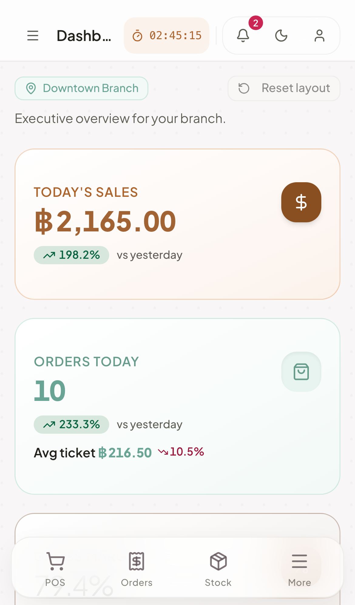</td>
<td>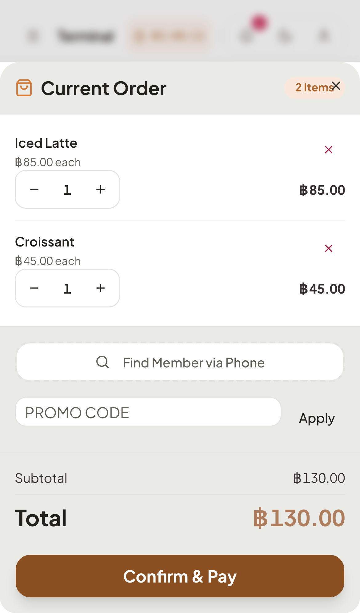</td>
<td>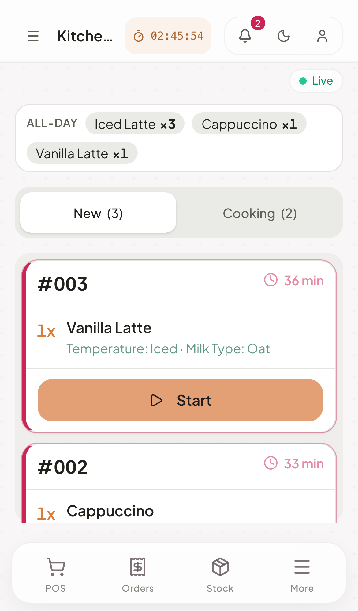</td>
<td>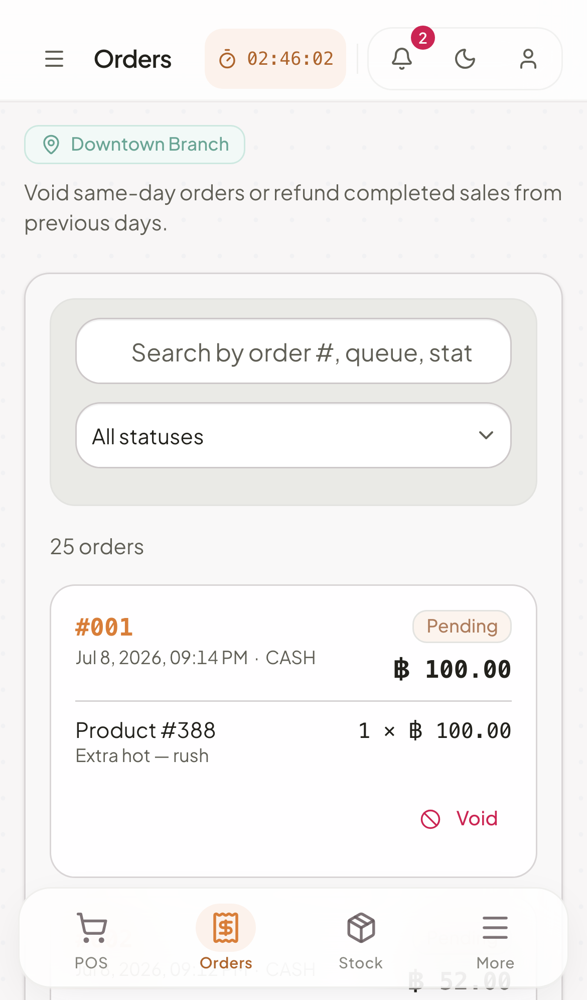</td>
</tr>
</table>

## Engineering decisions I'd defend in an interview

- **Transactional outbox over direct side effects** — business writes commit together with their events in one transaction, so accounting, loyalty, and realtime updates can be delayed but never lost or desynced.
- **Money is never a float** — all financial math runs on `Prisma.Decimal` with explicit rounding; journal entries must balance to the cent before they persist.
- **The API contract is a build artifact** — the backend exports `openapi.json`, the frontend generates its client types from it, shared enums generate from the Prisma schema, and CI fails on any drift. A breaking backend change is a red pipeline, not a runtime surprise.
- **JWT with real revocation** — httpOnly cookie plus a per-user token version, so logout actually invalidates stolen tokens (proven 200 → 401 in tests).
- **One authorization primitive** — every module resolves data through a shared branch-scope helper; staff can't reach another branch's data, and the guarantee doesn't depend on per-endpoint discipline.
- **Standard costing with an honest variance account** — production posts the gap between standard and actual cost to a dedicated GL account instead of pretending costs are always exact.

Each of these is expanded with the reasoning and trade-offs in [docs/architecture.md](docs/architecture.md).

## Tech stack

| Layer      | Stack                                                                             |
| ---------- | --------------------------------------------------------------------------------- |
| Frontend   | Next.js 16 (App Router), React 19, TanStack Query 5, Ant Design 6, Tailwind CSS 4 |
| Backend    | NestJS 11, Prisma 7, PostgreSQL, Passport JWT, socket.io                          |
| Testing    | Jest, Vitest, Playwright (with axe accessibility checks), supertest               |
| Infra & CI | Docker multi-stage builds, Docker Compose, GitHub Actions, Trivy image scanning   |

## Quick start

**Docker (recommended)** — migrations and demo seed run automatically:

```bash
cp infra/.env.compose.example infra/.env.compose
npm run docker:up
```

**Local Node** (Node 22, a running Postgres):

```bash
npm install
cp backend/.env.example backend/.env   # set DATABASE_URL, JWT_SECRET
npm run migrate
npm run db:seed                        # wipes the target database — demo data
npm run dev:backend                    # API on :3000
npm run dev:frontend                   # UI on :3001
```

Production modes, TLS on a VPS, and the env matrix: [infra/README.md](infra/README.md).

## Testing & quality

405 tests across four suites — backend unit (201, Jest), backend e2e against a real Postgres (15, supertest), frontend unit (174, Vitest), and frontend e2e (15, Playwright with axe accessibility smoke).

CI runs type-checks, lint, coverage thresholds, all four suites, a Docker Compose smoke test of the full stack, Trivy image scans, and drift checks for every generated artifact. The full strategy — what each suite proves and why: [docs/architecture.md](docs/architecture.md#testing-strategy).

```bash
npm test                    # unit suites
npm run test:e2e:backend
npm run test:e2e:frontend
```

## Documentation

| Doc                                            | What's inside                                                               |
| ---------------------------------------------- | --------------------------------------------------------------------------- |
| [docs/architecture.md](docs/architecture.md)   | Deep dive — outbox, accounting event map, inventory model, auth, trade-offs |
| [docs/demo.md](docs/demo.md)                   | 15-minute guided demo, all demo accounts, interview talking points          |
| [docs/design-system.md](docs/design-system.md) | Design tokens, form patterns, UI conventions                                |
| [infra/README.md](infra/README.md)             | Docker stacks, env matrix, production modes, TLS on a VPS                   |
| [backend/README.md](backend/README.md)         | API setup, architecture highlights, test commands                           |
| [frontend/README.md](frontend/README.md)       | UI setup, generated API types, test commands                                |

## Honest limitations

Deliberate scope choices for a portfolio-scale deployment — each with its reasoning in [docs/architecture.md](docs/architecture.md#deliberate-trade-offs):

- No account lockout (demo credentials are public; login is IP-throttled instead)
- Standard costing — no weighted-average recalculation on purchase receipts
- Whole-order refunds only; output VAT only (no input VAT on purchases)

Next on the roadmap: pagination across all list endpoints, end-to-end `Decimal` stock quantities, outbox dead-letter queue with replay, and scheduled stock reconciliation.

## About

Built solo by [Natthachak (@nkieu-config)](https://github.com/nkieu-config) as a software-engineering capstone project — design, schema, backend, frontend, tests, CI, and deployment.

📫 natthachak.config@gmail.com

## License

© 2026 Natthachak Jeungraksareechai — **all rights reserved**. This code is public so you can read it as a work sample; it is **not** licensed for reuse. Please don't copy it or submit it as your own. See [LICENSE](LICENSE).
