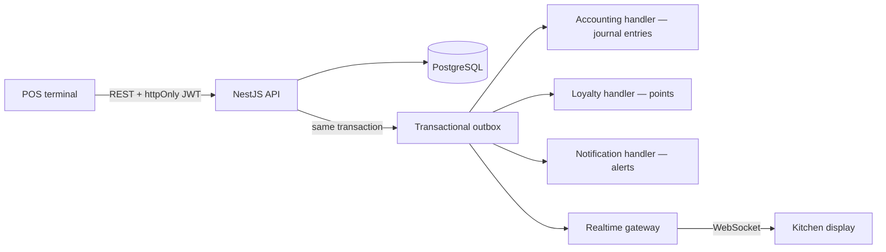

# Architecture

How BranchBrew ERP is put together, and why. This is the deep-dive companion to the [project README](../README.md) — read that first for the one-page overview.

## System shape



```
backend/          NestJS 11 API — 26 feature modules, Prisma 7, transactional outbox
frontend/         Next.js 16 App Router — POS, KDS, back office (42 pages)
packages/types    Shared enums generated from the Prisma schema
infra/            Docker Compose stacks + deployment reference
docs/             Demo script, design system, this document
scripts/          CI and Docker helper scripts
```

## Module map

The backend is organized as NestJS feature modules with zero `forwardRef` — the dependency graph is a DAG.

| Domain | Modules |
|---|---|
| Sales | `orders`, `products`, `modifiers`, `promotions`, `customers` (CRM loyalty) |
| Supply chain | `inventory`, `ingredients`, `procurement`, `production` (central kitchen BOM) |
| Back office | `hr`, `finance`, `accounting`, `reports`, `equipment`, `settings`, `audit` |
| Platform | `auth`, `branches`, `notifications`, `outbox`, `realtime`, `navigation`, `common`, `config`, `prisma` |

## Transactional outbox

The core reliability decision in the system. The POS never writes journal entries, awards points, or pushes WebSocket frames directly. Instead:

1. A business write (order placed, PO received, production completed, stocktake approved, payroll approved) commits **together with an outbox event row in the same database transaction**.
2. A dispatcher picks up committed events and fans them out to handlers: accounting, loyalty, notifications, and the realtime gateway.
3. Each event payload is checked by a runtime validator before a handler runs, so a malformed event fails loudly instead of posting garbage.

The consequence: side effects can be delayed, but they can never desync from committed state. If the process dies between commit and dispatch, the event is still in the table and gets processed on recovery. There is no scenario where an order exists but its journal entry silently never will.

Known hardening still on the roadmap: exponential backoff, a dead-letter queue with replay, and payload schema versioning.

## Event-driven double-entry accounting

Every money-moving domain event posts a **balanced** journal entry. The ledger is not a report bolted on afterwards — it is written by the same events that move stock and cash, so the operational numbers and the accounting numbers agree by construction.

| Event | Journal entry |
|---|---|
| POS sale | Revenue split into ex-VAT sales + output VAT liability, plus COGS from the recipe cost |
| Refund / void | Reversing entry; deducted batches are restored |
| PO goods received | Inventory asset vs accounts payable |
| Supplier payment | Settles AP — the AP account balance reconciles to the unpaid-PO list on the aging card |
| Payroll approved | Gross pay, withholdings, and net cash |
| Stocktake variance approved | Shrinkage expense; batches adjusted FEFO |
| Production completed | Finished goods at standard cost; any cost variance posts to a dedicated variance account (5030) |

Reporting built on top: P&L trend, AP aging, and a ภ.พ.30-style output VAT report with CSV export.

### Money is never a float

All financial math runs on `Prisma.Decimal` with explicit rounding scales. Journal entries are validated to balance to the cent before they persist. Loyalty-point redemption is clamped to the discount it can actually absorb, and point clawback on refund floors at zero — no negative balances from arithmetic edge cases.

### Standard costing

Ingredient costs are fixed per unit (`costPerUnit`) rather than recomputed as weighted averages on receipt. That is a deliberate trade-off: it keeps COGS deterministic and demo-friendly, and production honestly posts the difference between standard and actual to the variance account instead of pretending costs are always exact.

## Inventory: batches, FEFO, and the stocktake loop

- Stock lives in **batches** with expiry dates. Deduction is first-expired-first-out (FEFO), so the system uses up the milk that expires tomorrow before the carton delivered today.
- The database enforces `CHECK (stock >= 0)` — negative stock is impossible even under concurrent writes.
- **Blind stocktakes** snapshot expected stock at submit time; approved variances adjust batches FEFO and post shrinkage to the ledger. Physical reality corrects the books through the same audited pipeline as everything else.
- Inter-branch transfers do not reserve stock at request time; acceptance re-validates availability atomically.

## Authentication and authorization

- **JWT in an httpOnly cookie** — no tokens in localStorage, no XSS token theft surface.
- **Token-version revocation** — each user carries a token version; logout bumps it, so a stolen token is actually dead after logout (verified in tests: 200 → 401).
- **Branch-scoped RBAC** — `SUPER_ADMIN` sees all branches; managers and staff resolve every query through a shared branch-scope helper used across all modules, so one primitive (not per-endpoint discipline) guarantees staff can't reach another branch's data.
- Login is IP-throttled rather than account-locked, because the demo credentials are public and lockout would let strangers lock reviewers out.

## Typed contract across the stack

The API contract is a build artifact, not a convention:

1. The backend exports `openapi.json` from its Swagger decorators.
2. The frontend generates its client types (`api.d.ts`) from that file.
3. Shared enums in `packages/types` are generated from the Prisma schema.
4. **CI fails if any generated artifact drifts** from its source.

A backend change that breaks the frontend is a compile error and a red pipeline, not a runtime surprise.

## Frontend architecture

- Next.js 16 App Router with a server-layout auth gate — unauthenticated users never render an app shell.
- TanStack Query 5 for server state, with race-safe optimistic updates.
- A typed `ApiError` envelope (error code + request ID) flows from the backend's exception filter into the client.
- Realtime KDS over socket.io with a live connection badge and reconnect toasts.
- Design tokens and form conventions are documented in [design-system.md](design-system.md).

## Testing strategy

405 tests, split by what each layer can actually prove:

| Suite | Tests | What it proves |
|---|---|---|
| Backend unit (Jest) | 201 | Money math, order lifecycle, accounting postings, report shape |
| Backend e2e (supertest) | 15 | Auth, orders, production, and branch scoping against a real Postgres |
| Frontend unit (Vitest) | 174 | Validators, filters, API client behavior |
| Frontend e2e (Playwright) | 15 | Login, full POS checkout, KDS, axe accessibility smoke |

CI additionally runs type-checks, lint, coverage thresholds, a Docker Compose smoke test of the full stack, Trivy image scans, and the generated-artifact drift checks above.

## Deliberate trade-offs

Choices made knowingly for a portfolio-scale deployment, with the reasoning:

- **No account lockout** — see [auth](#authentication-and-authorization) above.
- **Standard costing, no weighted average** — see [standard costing](#standard-costing) above; partial PO receipt is likewise out of scope.
- **Whole-order refunds only** — partial refunds multiply the accounting reversal cases without demonstrating a new concept.
- **Output VAT only** — sales post VAT to a liability account; input VAT on purchases is out of scope for the demo.
- **No promotion usage limits** — promo codes validate eligibility but not redemption counts.

Roadmap beyond demo scale: pagination across all list endpoints (audit and auth already paginate), end-to-end `Decimal` stock quantities, outbox hardening (backoff, dead-letter queue, replay), and a scheduled reconciliation between branch stock and batch-level quantities.
