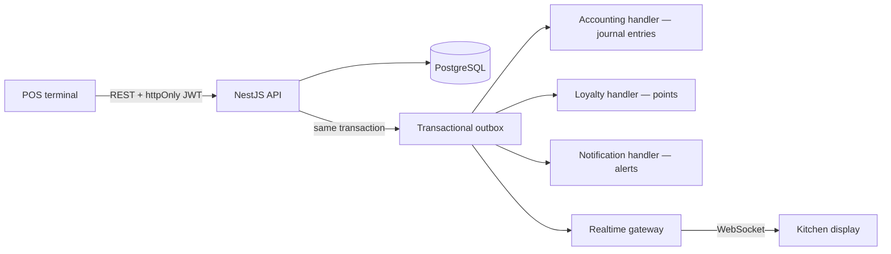

# Architecture

How BranchBrew ERP is put together, and why. This is the deep-dive companion to the [project README](../README.md) — read that first for the one-page overview.

## System shape



```text
backend/          NestJS 11 API — 23 feature modules, Prisma 7, transactional outbox
frontend/         Next.js 16 App Router — POS, KDS, back office (42 pages)
packages/types    Shared enums generated from the Prisma schema
infra/            Docker Compose stacks + deployment reference
docs/             Demo script, design system, this document
scripts/          CI and Docker helper scripts
```

## Module map

The backend is organized as NestJS feature modules with zero `forwardRef` — the dependency graph is a DAG.

| Domain | Modules |
|---|---|
| Sales | `orders`, `products`, `modifiers`, `promotions`, `customers` (CRM loyalty) |
| Supply chain | `inventory`, `ingredients`, `procurement`, `production` (central kitchen BOM) |
| Back office | `hr`, `finance`, `accounting`, `reports`, `equipment`, `settings`, `audit` |
| Platform | `auth`, `branches`, `notifications`, `outbox`, `realtime`, `navigation`, `common`, `config`, `prisma` |

The schema behind these modules — core ERD and the invariants the database itself enforces — is in [data-model.md](data-model.md).

## Where to start reading the code

The fastest path through ~77k lines, following one sale from POS to ledger:

1. [`backend/src/orders/order-creation.service.ts`](../backend/src/orders/order-creation.service.ts) — the heart of the system in one file: a single transaction validates the order, deducts ingredient batches FEFO, and enqueues the outbox events that everything downstream runs on.
2. [`backend/src/outbox/outbox.processor.ts`](../backend/src/outbox/outbox.processor.ts) — claims `PENDING` events in a drain loop until the queue is empty, reclaims events stranded by a dead worker via their stale `claimedAt`, and dispatches through the validated registry in [`outbox-event.registry.ts`](../backend/src/outbox/outbox-event.registry.ts).
3. [`backend/src/accounting/accounting.service.ts`](../backend/src/accounting/accounting.service.ts) — the `@OnEvent` handlers that turn domain events into balanced journal entries, deduping on the unique `reference` so at-least-once delivery never double-posts.
4. [`backend/src/auth/branch-scope.util.ts`](../backend/src/auth/branch-scope.util.ts) — the one authorization primitive every branch-owned endpoint resolves through.
5. The tests that prove the hard claims: [`order-void-concurrency.e2e-spec.ts`](../backend/test/order-void-concurrency.e2e-spec.ts) (racing voids against real Postgres), [`outbox-stale-claim.e2e-spec.ts`](../backend/test/outbox-stale-claim.e2e-spec.ts) (recovery from a worker that dies mid-dispatch), and the cross-branch 403 in [`finance.e2e-spec.ts`](../backend/test/finance.e2e-spec.ts).

Money math lives in [`common/decimal.util.ts`](../backend/src/common/decimal.util.ts) and [`common/vat.util.ts`](../backend/src/common/vat.util.ts). On the frontend, start at `frontend/src/lib/query-keys/` (cache invalidation map) and `useKdsSocketSync` (realtime cache patching).

## Transactional outbox

The core reliability decision in the system. The POS never writes journal entries, awards points, or pushes WebSocket frames directly. Instead:

1. A business write (order placed, PO received, production completed, stocktake approved, payroll approved) commits **together with an outbox event row in the same database transaction**.
2. A dispatcher picks up committed events and fans them out to handlers: accounting, loyalty, notifications, and the realtime gateway.
3. Each event payload is checked by a runtime validator before a handler runs, so a malformed event fails loudly instead of posting garbage.

Delivery is **at-least-once** through both crash windows: an event that commits but never dispatches stays `PENDING`, and one whose worker dies mid-dispatch is reclaimed once its `claimedAt` stamp goes stale. Redelivery is harmless because the ledger dedupes on a unique natural `reference`. The consequence: side effects can be delayed, but they can never desync from committed state. There is no scenario where an order exists but its journal entry silently never will.

Throughput is a measured property, not an assumption. A k6 load test caught the original processor — one batch of 10 events every 10 seconds — draining at exactly 1.00 events/sec while the till sold 20 orders/sec, leaving the ledger nine and a half minutes behind after a 30-second rush. The processor now drains in a loop until the queue is empty, polls every second behind a re-entrancy guard, and gives failed events a 30-second retry backoff so the faster tick cannot burn through their five attempts in seconds. Measured after the fix, the drain rate tracks the arrival rate up to at least 150 events/sec, with lag bounded by the poll interval (p50 0.5 s). The harness is in [loadtest/README.md](../loadtest/README.md); the before-and-after numbers are in the [README's Performance section](../README.md#performance--the-bottleneck-the-load-test-found-and-the-fix).

Known hardening still on the roadmap: an operator replay path for `FAILED` events (terminal today, visible only in logs), jitter on the retry backoff, and payload schema versioning.

## Event-driven double-entry accounting

Every money-moving domain event posts a **balanced** journal entry. The ledger is not a report bolted on afterwards — it is written by the same events that move stock and cash, so the operational numbers and the accounting numbers agree by construction.

| Event | Journal entry |
|---|---|
| POS sale | Revenue split into ex-VAT sales + output VAT liability, plus COGS from the recipe cost |
| Refund / void | Reversing entry; deducted batches are restored |
| PO goods received | Inventory asset vs accounts payable |
| Supplier payment | Settles AP — the AP account balance reconciles to the unpaid-PO list on the aging card |
| Payroll approved | Gross pay, withholdings, and net cash |
| Stocktake variance approved | Shrinkage expense; batches adjusted FEFO |
| Production completed | Finished goods at standard cost; any cost variance posts to a dedicated variance account (5030) |

Reporting built on top: P&L trend, AP aging, and a ภ.พ.30-style output VAT report with CSV export.

### Money is never a float

All financial math runs on `Prisma.Decimal` with explicit rounding scales and a half-up tie-break. Journal entries are validated to balance to the cent before they persist. Loyalty-point redemption is clamped to the discount it can actually absorb, and point clawback on refund floors at zero — no negative balances from arithmetic edge cases.

Stock *quantities* are the exception — see inventory, below.

### Standard costing

Ingredient costs are fixed per unit (`costPerUnit`) rather than recomputed as weighted averages on receipt. That is a deliberate trade-off: it keeps COGS deterministic and demo-friendly, and production honestly posts the difference between standard and actual to the variance account instead of pretending costs are always exact.

## Inventory: batches, FEFO, and the stocktake loop

- Stock lives in **batches** with expiry dates. Deduction is first-expired-first-out (FEFO), so the system uses up the milk that expires tomorrow before the carton delivered today.
- The database enforces `CHECK (stock >= 0)` — negative stock is impossible even under concurrent writes.
- **Blind stocktakes** snapshot expected stock at submit time; approved variances adjust batches FEFO and post shrinkage to the ledger. Physical reality corrects the books through the same audited pipeline as everything else.
- Inter-branch transfers do not reserve stock at request time; acceptance claims the `PENDING` transfer with a conditional update before it moves a single batch, so two simultaneous accepts cannot double-move stock.
- **Quantities are `Float`, not `Decimal`** — the one place binary floating point survives. Repeated fractional deductions can drift `BranchInventory.stock` from `SUM(batches.quantity)`; the column migration and a reconciliation job are on the roadmap. Money is unaffected — costing reads `costPerUnit`, a `Decimal`.

## Authentication and authorization

- **JWT in an httpOnly cookie** — no tokens in localStorage, no XSS token theft surface.
- **Token-version revocation** — each user carries a token version. Logout bumps it, and so does any administrative change to a user's branch, role, or password, so demoting, reassigning, or locking out a user kills their live tokens immediately rather than at expiry.
- **Branch-scoped RBAC** — `SUPER_ADMIN` sees all branches; managers and staff resolve branch-owned queries through a shared branch-scope helper (`resolveBranchId` / `assertBranchAccess`) rather than per-endpoint discipline, and an e2e test proves a cross-branch write is rejected with a 403. `Customer` is chain-level and has no `branchId`, so loyalty lookups are unscoped — any staff account can search any customer's phone. That is a privacy gap rather than an intent; scoping it and logging reads of personal data are the top PDPA items on the roadmap.
- Login is IP-throttled rather than account-locked, because the demo credentials are public and lockout would let strangers lock reviewers out.

## Typed contract across the stack

The API contract is a build artifact, not a convention:

1. The backend exports `openapi.json` from its Swagger decorators.
2. The frontend generates its client types (`api.d.ts`) from that file.
3. Shared enums in `packages/types` are generated from the Prisma schema.
4. **CI fails if any generated artifact drifts** from its source.

A backend change that breaks the frontend is a compile error and a red pipeline, not a runtime surprise.

## Frontend architecture

- Next.js 16 App Router with a server-layout auth gate — unauthenticated users never render an app shell.
- TanStack Query 5 for server state, with race-safe optimistic updates.
- A typed `ApiError` envelope (error code + request ID) flows from the backend's exception filter into the client.
- Realtime KDS over socket.io with a live connection badge and reconnect toasts.
- Design tokens and form conventions are documented in [design-system.md](design-system.md).

## Testing strategy

432 tests, split by what each layer can actually prove:

| Suite | Tests | What it proves |
|---|---|---|
| Backend unit (Jest) | 220 | Money math and rounding ties, order lifecycle, concurrent-claim guards, outbox reclaim, accounting postings |
| Backend e2e (supertest) | 20 | Auth, orders, branch scoping, concurrent order voids, and outbox recovery from a dead worker — all against a real Postgres |
| Frontend unit (Vitest) | 177 | Validators, filters, VAT parity with the backend, API client behavior |
| Frontend e2e (Playwright) | 15 | Login, full POS checkout, KDS, axe accessibility smoke |

CI additionally runs type-checks, lint, coverage thresholds, a Docker Compose smoke test of the full stack, Trivy image scans, and the generated-artifact drift checks above.

## Deployment

A commit reaches the live demo in minutes, with no manual step:

| Trigger | What runs |
|---|---|
| `git push` | A husky pre-push hook runs the local gate — type-check, lint, and both unit suites. The e2e suites need a database and a running stack, so they are CI's job |
| Push to `main` | GitHub Actions CI runs; **in parallel**, Vercel rebuilds the frontend and Render rebuilds the API image (`autoDeploy: true` in [`render.yaml`](../render.yaml)) |
| Push to `main` touching `prisma/migrations/**` | [`migrate-demo.yml`](../.github/workflows/migrate-demo.yml) applies pending migrations to the Supabase demo database and fails if any remain pending |
| Every 3 hours | [`refresh-demo.yml`](../.github/workflows/refresh-demo.yml) reseeds the Supabase demo database so today's sales, orders, and kitchen tickets stay live |

The frontend is a Vercel project rooted at `frontend/`; the API is a Docker service built from `backend/Dockerfile`. Both talk to the same managed Postgres. The wiring that makes a split-domain deploy work — the same-origin `/backend` rewrite that keeps the auth cookie first-party, the pooler-vs-direct connection, free-tier cold starts — is documented in [infra/README.md](../infra/README.md).

**Trade-off — deploys are not gated on CI.** Vercel and Render start building the moment a commit lands on `main`, in parallel with the CI workflow rather than after it, so CI reports on a deploy that is already happening. The practical gate is the pre-push hook: type-check, lint and the unit suites must pass locally before anything reaches `main`. That is sufficient for a single maintainer but not for a team, because a hook is local and can be bypassed with `--no-verify`. Gating properly means disabling both platforms' auto-deploy and firing their deploy hooks from a CI job that `needs:` the test jobs — a deliberate next step rather than an oversight.

**Trade-off — the deploy does not run migrations.** Render starts the API image directly, and `migrate-demo.yml` applies migrations on push in parallel with that build rather than before it. So **migrations must stay backward-compatible with the deployed code** — additive columns and indexes, never a rename or a drop in the same release.

## Deliberate trade-offs

Choices made knowingly for a portfolio-scale deployment, with the reasoning:

- **No account lockout** — see [auth](#authentication-and-authorization) above.
- **Standard costing, no weighted average** — see [standard costing](#standard-costing) above; partial PO receipt is likewise out of scope.
- **Whole-order refunds only** — partial refunds multiply the accounting reversal cases without demonstrating a new concept.
- **Output VAT only** — sales post VAT to a liability account; input VAT on purchases is out of scope for the demo.
- **No promotion usage limits** — promo codes validate eligibility but not redemption counts.

Roadmap beyond demo scale: pagination across all list endpoints (audit and auth already paginate), branch-scoping and read-auditing for customer records, end-to-end `Decimal` stock quantities with a scheduled reconciliation between branch stock and batch-level quantities, outbox hardening (an operator replay path, jitter on the retry backoff), and metrics with an alert on failed outbox events.
