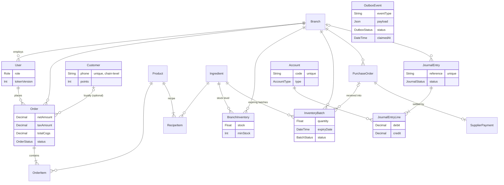

# Data model

The core of the 41-table Prisma schema and the invariants the database itself enforces. This is the companion to [architecture.md](architecture.md) — read that first for why the system is shaped this way. The full schema lives in [`backend/prisma/schema.prisma`](../backend/prisma/schema.prisma).

## Core ERD

The spine of the system — the tables a sale, a delivery, and a journal entry flow through. Supporting domains (HR, equipment, notifications, audit) are listed in the domain map below.

`OutboxEvent` deliberately has **no foreign keys** — it carries a self-contained JSON payload, validated at dispatch time, so an event row can outlive schema churn in the tables it describes. It connects to the rest of the model by transaction boundary, not by relation: business writes enqueue outbox rows inside the same database transaction.

## Invariants the database enforces

Rules that hold even if application code is wrong, racing, or retried:

| Invariant | Mechanism | Why it matters |
|---|---|---|
| Stock can never go negative | `CHECK (stock >= 0)` on `BranchInventory`, `CHECK (quantity >= 0)` on `InventoryBatch` ([migration](../backend/prisma/migrations/20260705130000_stock_non_negative_check/migration.sql)) | Concurrent FEFO deductions cannot oversell — the losing transaction fails instead of driving stock below zero |
| A domain event posts to the ledger at most once | `JournalEntry.reference` is unique (`ORD-*`, `PO-*`, `PAYROLL-*`) | The outbox is at-least-once; redelivery hits the unique key and dedupes instead of double-posting |
| One stock row per ingredient per branch | `@@unique([branchId, ingredientId])` on `BranchInventory` | Upserts under concurrency converge on one row |
| One payment per purchase order | `SupplierPayment.poId` is unique | Accounts payable settles exactly once per PO |
| Queue numbers never collide | `@@unique([branchId, queueDate, queueNumber])` on `Order` | Two simultaneous POS sales cannot print the same queue ticket |
| Revoked sessions stay revoked | `User.tokenVersion` — bumped on logout and on any admin change to role, branch, or password | A JWT minted before the bump fails validation on its next request |
| One loyalty identity per phone | `Customer.phone` is unique | Points accrue to a single member record chain-wide |

## Numeric types: where precision lives

- **Money is `Decimal(19,4)` everywhere** — order amounts, VAT, COGS, journal debit/credit, payroll, supplier payments. Rounding is explicit with a half-up tie-break, and journal entries must balance to the cent before they persist.
- **Stock quantities are `Float`** — the one surviving use of binary floating point, and a documented trade-off: repeated fractional deductions can drift `BranchInventory.stock` from the sum of its batches. Costing is unaffected because it reads `Ingredient.costPerUnit`, a `Decimal`. The reasoning and the migration plan are in [architecture.md](architecture.md#inventory-batches-fefo-and-the-stocktake-loop).
- **Loyalty points are `Int`** — earned, redeemed, and clawed back in whole points, floored at zero.

## Scoping model

Almost every operational table hangs off `Branch`, and branch-owned queries resolve through a shared scope helper (see [auth in architecture.md](architecture.md#authentication-and-authorization)). Two deliberate exceptions:

- **`Customer` is chain-level** — loyalty follows the member across branches, so it has no `branchId`. The privacy consequence (any staff account can look up any member) is a documented gap, not an accident.
- **`Account` (chart of accounts) and `SystemSetting` are global** — one ledger taxonomy and one settings store for the whole chain.

## Domain map — all 41 tables

| Domain | Tables |
|---|---|
| Org & auth | `User`, `Branch` |
| Catalog & sales | `Product`, `RecipeItem`, `Order`, `OrderItem`, `ModifierGroup`, `ModifierOption`, `OrderItemModifier`, `Promotion`, `Customer` |
| Inventory | `Ingredient`, `BranchInventory`, `InventoryBatch`, `StockTransfer`, `StockCount`, `StockCountLine`, `StockAdjustment`, `WasteLog` |
| Procurement | `Supplier`, `PurchaseOrder`, `PurchaseOrderItem`, `SupplierPayment` |
| Production | `ProductionBOM`, `ProductionOrder` |
| HR & payroll | `Shift`, `AttendanceRecord`, `LeaveRequest`, `PayrollRun`, `Payslip` |
| Finance & accounting | `Account`, `JournalEntry`, `JournalEntryLine`, `Expense`, `ShiftSettlement` |
| Equipment | `Equipment`, `MaintenanceLog` |
| Platform | `OutboxEvent`, `AuditLog`, `Notification`, `SystemSetting` |

State machines (`OrderStatus`, `POStatus`, `TransferStatus`, `StockCountStatus`, `PayrollStatus`, `ProductionStatus`, `OutboxStatus`, …) are Prisma enums on these tables; transitions are role-gated in the service layer with conditional updates claiming the current state before side effects run.
